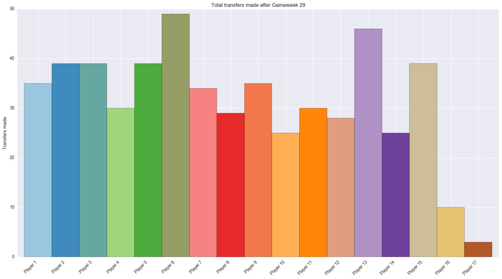
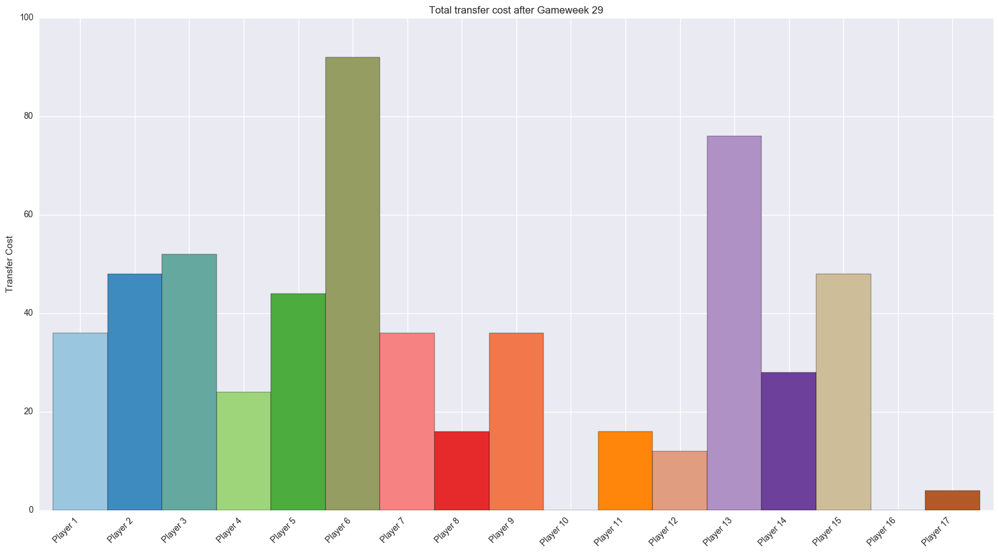
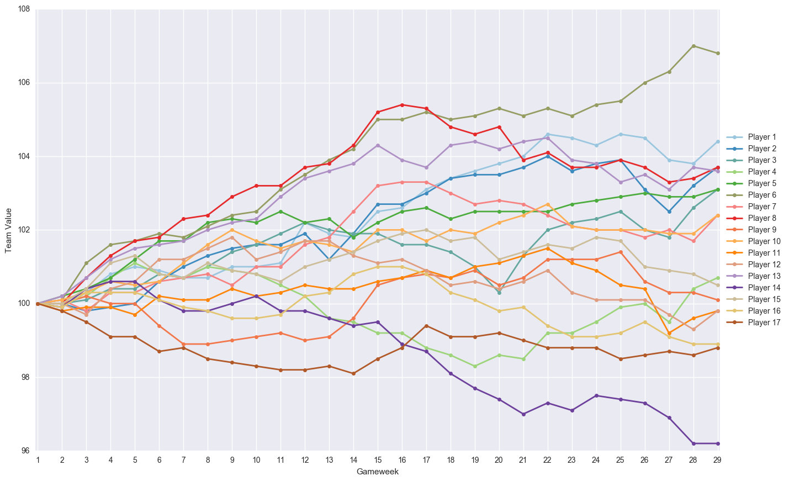
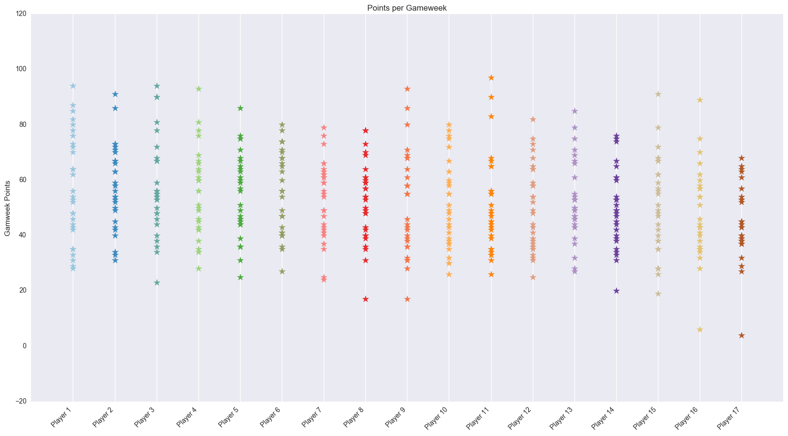
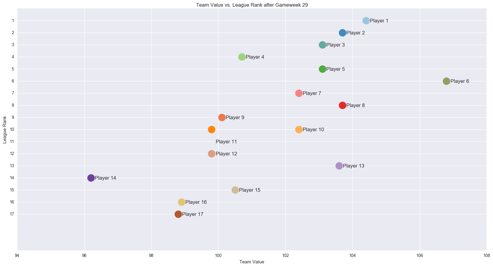
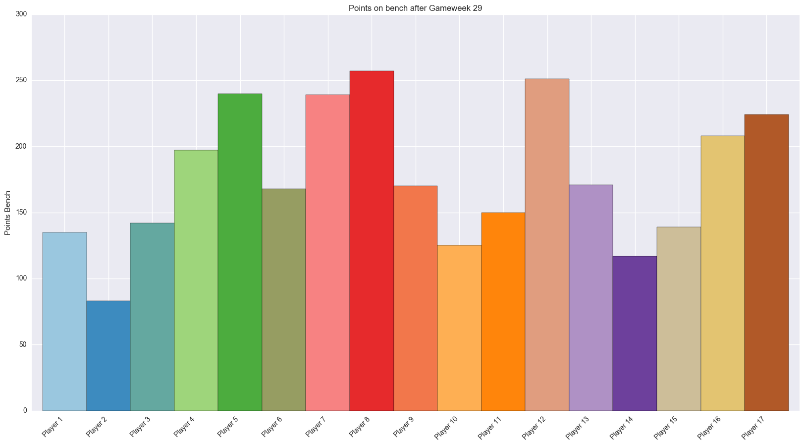
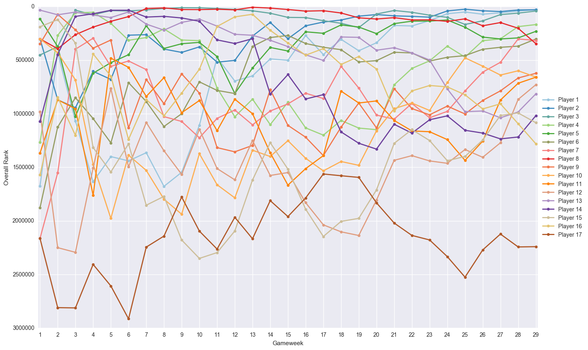
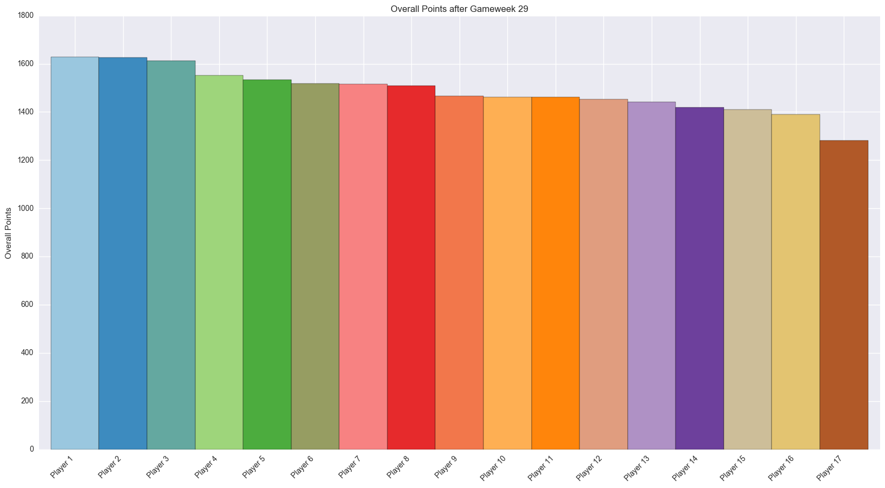
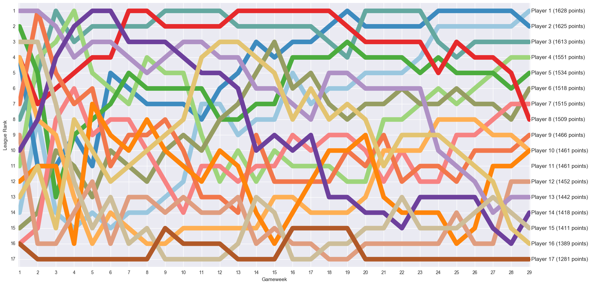

# fpl-stats
Python scripts for visualising statistics from Fantasy Premier League based on league ID

## fpl.py
This script uses the Fantasy Premier League API to extract all information from a certain league ID and puts this into a pandas dataframe before creating various plots.
The league ID is found as the number XXXXXX in links as the following: fantasy.premierleague.com/a/leagues/standings/XXXXXX/classic

## plotly_fpl.py

This script produces a "bubble visualisation" using the online graphing tool [plot.ly](https://plot.ly/). Note that an account must be created to use this tool.

Most of the code is taken/inspired by this tutorial: https://plot.ly/python/gapminder-example/
For more inspiration, this site may be useful: https://plot.ly/python/bubble-charts-tutorial/

When exporting the animation to a html file in plot.ly, the minified plotly.js script may be replaced by a CDN link:
```
<head>
<script src="https://cdn.plot.ly/plotly-latest.min.js"></script>
</head>
```

The visualisation looks like [this](https://raw.githack.com/oysteinbf/fpl-stats/master/bubbles_example.html).

### Example plots from fpl.py:










